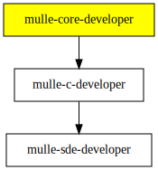

# mulle-core-developer

#### 🤠 mulle-core developer kit for mulle-sde

This is a collection of [mulle-sde](//github.com/mulle-sde)
*extensions* to support C-only development of code, that uses the
[mulle-core](//github.com/mulle-core) library.

It inherits all the functionality from [mulle-c-developer](//github.com/mulle-c/mulle-c-developer)

### You are here

## Author

[Nat!](https://mulle-kybernetik.com/weblog) for Mulle kybernetiK  

